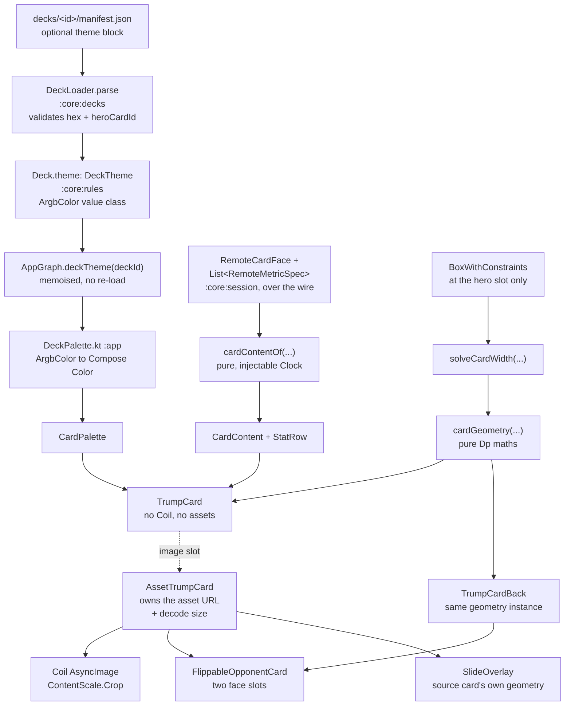

# Card Visual Identity — Technical Design

**Feature:** [`PRD.md`](PRD.md)
**Date:** 2026-08-01
**Status:** Draft

## Architecture at a Glance

- **One card composable, two layers.** A pure `TrumpCard` that knows nothing about Coil or assets and
  takes its photo as a `@Composable` slot, plus a thin `AssetTrumpCard` wrapper that supplies the
  `file:///android_asset/...` image and owns the decode-size guarantee. The slot is what makes the
  card simultaneously Robolectric-testable and `@Preview`-able — see
  [ADR: card image slot](../../adr/card-visual-identity-card-image-slot.md).
- **Card size is arithmetic, not layout.** A pure `cardGeometry(width, variant, minRowHeight)`
  function computes every zone height. Passing one `CardGeometry` instance to both faces of the flip
  makes front/back pixel-identity structural rather than conventional. Being pure `Dp` maths, it is
  also a **third test seam that needs no Compose runtime at all** — the cheapest and highest-value
  coverage in the feature.
- **Deck theme is manifest data, resolved locally.** An optional `theme` block parses into a
  `DeckTheme` on `:core:rules` carrying ARGB value classes (not hex strings), converted to Compose
  `Color` at the `:app` edge. It never crosses the wire — see
  [ADR: deck theme block](../../adr/card-visual-identity-deck-theme-block.md).
- **`:app` gets a JUnit 4 test source set** for Robolectric + Compose semantics tests, diverging from
  the repo's JUnit 5 — the only workable option, and already precedented on the unmerged
  `feature/history` branch. See [ADR: app test framework](../../adr/card-visual-identity-app-test-framework.md).
- **The PRD's 48dp rule is not implementable as written** and is superseded here by a
  grow-then-absorb geometry with an explicit degraded mode on small screens — see
  [ADR: card geometry](../../adr/card-visual-identity-card-geometry.md) and Open Questions.

## Design Decisions

### 1. Card composable API — pure core, asset wrapper

`TrumpCard` takes a `CardGeometry`, a `CardPalette`, a `CardContent`, an optional
`onChooseStat: ((String) -> Unit)?`, and the photo as `image: @Composable (Modifier) -> Unit`.
`AssetTrumpCard` wraps it and is the **only** place in the codebase that mentions
`file:///android_asset`. `CardImage` in `MatchScreen.kt` is deleted.

Null `onChooseStat` means read-only. This makes the PRD's test *"the mini variant exposes no
clickable rows"* true by construction rather than by assertion, and removes a parameter type that
would otherwise need a `remember` at each call site to avoid defeating skipping.

**Stability trap to avoid:** the image slot must be written *inline* inside a composable
(`AssetTrumpCard`), never returned from a plain factory function. A lambda returned from a
non-composable function is a fresh instance every call, so the `image` parameter never compares equal
and `TrumpCard` never skips — silently undoing this repo's stability work. `CardContent` and
`StatRow` hold a `List`, so both need `@Immutable`; they live in `com.toptrumps.app` and are
Compose-compiled, so the annotation is the right lever rather than another `compose-stability-config.conf`
entry.

**Values arrive pre-formatted.** `formatStat`'s `YEARS_SINCE_VALUE` branch calls `Clock.System`; if
that ran inside the card, previews would drift year to year and the Robolectric test would be
time-dependent. Mapping is a pure `cardContentOf(card, metrics, now: Clock, …)` in its own file,
which also makes the years-since derivation unit-testable — a gap today.

**The card must never read `MaterialTheme.colorScheme`.** Story 20 requires the card keep its printed
colours in dark mode. Sourcing every card colour from the `CardPalette` parameter makes that
structurally impossible to break, and keeps previews honest.

### 2. Card geometry and the 48dp floor

See [ADR: card geometry](../../adr/card-visual-identity-card-geometry.md) for the full derivation.

With banner 10% / window 50% / table 40% of a nominal `h = 1.5w`, the nominal row height is `0.12w`,
which equals 48dp exactly at `w = 400dp`. **Below a 400dp-wide card the floor always binds — that is
the normal case on a phone, not an edge case.**

```
row    = max(0.12w, minRow)
height = 0.9w + 5·minRow    (floor binding)   |   1.5w   (otherwise)
```

Continuous at the crossover and invertible, so `solveCardWidth(maxWidth, maxHeight, minRowHeight)`
picks the largest card that fits. The pleasing consequence: **phones are width-bound and run ~2%
taller than 2:3; large screens are height-bound and land at exactly 2:3**, with no special-casing.

`minRowHeight` is the single knob across the feature: **48dp** hero (tap target), **28dp** reveal
(two values plus an outcome glyph must be legible), **0dp** opened pile card.

`BoxWithConstraints` is used **exactly once**, at the hero slot — never inside `TrumpCard`, which
would mean 30 subcompositions in the win-pile grid. The height budget falls out of the `Column`
naturally: top bar and action strip measure at intrinsic height, the card's `Box` takes
`Modifier.weight(1f)`, so `maxHeight` inside `BoxWithConstraints` *is* the hero budget. If the action
strip grows (two-line prompt, or uncapped font scale), the card shrinks automatically — the correct
failure mode, and a direct consequence of "chrome scales uncapped".

### 3. Font-scale cap

Clamp `fontScale` only, preserving `density`:

```kotlin
Density(density = current.density, fontScale = min(current.fontScale, 1.3f))
```

Reconstructing density, or using `Density(1f, scale)`, silently changes `dp` as well as `sp`. Return
`current` unchanged when uncapped so the provided value is identical to ambient and the subtree isn't
spuriously invalidated. The provider goes **inside** `TrumpCard`/`TrumpCardBack` so no call site can
forget it.

Two caveats to carry as code comments: on API 34+ the platform applies font scaling **non-linearly**
via `FontScaleConverter`, so a hand-built `Density(density, 1.3f)` is a *linear* 1.3× and won't be
pixel-identical to the system set to 1.3× — acceptable for a cap, but don't let someone chase it as a
bug later. And capping doesn't prevent overflow: `BasicText`'s `autoSize` landed in foundation 1.8
and this BOM is 1.7.x, so the mitigation is layout (label ellipsises, value never does), not
auto-shrink.

### 4. Animation rework

`FlippableOpponentCard` loses `RemoteCardFace`, `deckId`, `ImageLoader` and `size: Dp` entirely,
taking two face slots instead. `CardAnimations.kt` stops knowing what a card is. Geometry identity
becomes the caller's job, discharged structurally by building both faces from one `CardGeometry`.

**A pre-existing per-frame recomposition bug must be fixed as part of this work.**
`CardAnimations.kt:131` reads `rotation.value` in the composable body to branch between back and
front — the exact pattern `SlideOverlay`'s own doc comment warns against. Today the leaf is one
`AsyncImage` so it's cheap; **after this change the leaf is a 5-row stat table recomposed ~25 times
per flip.** Fix by composing both faces once and driving visibility from inside `graphicsLayer`
lambdas:

```kotlin
Box(Modifier.graphicsLayer { alpha = if (rotation.value <= 90f) 1f else 0f }) { back(Modifier) }
Box(Modifier.graphicsLayer { alpha = if (rotation.value > 90f) 1f else 0f; rotationY = 180f }) { front(Modifier) }
```

The 180° counter-rotation is preserved verbatim. Both faces now measure in the same pass into the
same `Box`, which is a *stronger* identity guarantee than the current branch-swap. Bonus: the photo
decodes during the back-facing half of the flip, fixing the empty-window flash on the first reveal
frames.

`SlidingCard`'s four fields (`deckId`, `imageFile`, `name`, `imageLoader`) collapse into one content
lambda, and `SlideOverlay` stops sizing content at all — the lambda carries its own geometry.

**The slide renders the source card's own geometry, not the mini variant — contradicting the PRD.**
The PRD asks for mini, but a hero card is ~379×581dp while a mini at the same width is a different
height, so the swap is a visible shape jump at t=0 — violating the PRD's own "an animating card never
changes shape mid-flight" in the same paragraph. Passing the caller's existing geometry makes the
jump structurally impossible. At 0.35 scale the table is unreadable, but by then it is 70% faded and
moving; continuity beats legibility. Mini is therefore used for the win-pile grid and deck tiles only.

`transformOrigin(0f, 0f)` with top-left→top-left lerping was fine for a 220dp square; with a 581dp
card the visual centre drifts badly. Lerp centres and subtract the scaled half-size — still entirely
inside the `offset {}` lambda.

`AnimationGate` needs no change.

### 5. Match screen layout

```
Box(fillMaxSize).reportGlobalPosition { overlayOrigin = it }     // unchanged
  Column(fillMaxSize)
    MatchTopBar(...)                                            // intrinsic height
    Box(Modifier.weight(1f), Alignment.Center)
      BoxWithConstraints { HeroCard | RevealPair }
    MatchActionStrip(...)                                       // intrinsic height
  SlideOverlay(...)                                             // unchanged
```

Rects are `boundsInRoot()`, so moving the score labels out of a scrolling column changes nothing
about the overlay's coordinate maths. `positions.myPileLabel`/`opponentLabel` move into
`MatchTopBar` — a rename, not a relocation.

**Side-by-side row alignment is a non-problem if solved correctly.** `cardGeometry` is deterministic
in `(width, variant, minRowHeight)`, so two cards at the same width already have identical row
heights. Hand both cards the *same* `CardGeometry` instance. Do **not** reach for `IntrinsicSize.Min`,
a shared `SubcomposeLayout`, or alignment lines — all three measure both cards to reconcile them,
which is unnecessary, adds a measure pass, and is fragile once one card is inside a `graphicsLayer`
mid-flip.

`AwaitingChoiceContent`'s five `Button`s are deleted. Per-row disabled state comes from
`spec.key in round.remainingMetrics` and `session.hasPendingIntent` folded into `StatRow.enabled` —
the same composition as today's `enabled = available && !pending`. The `SELECT` sound cue fires from
the `MatchScreen` call site's `onChooseStat` handler; **the card takes no `SoundEffects`**.

### 6. Theme foundation and plumbing

New `app/src/main/kotlin/com/toptrumps/app/theme/` — `Color.kt`, `Type.kt`, `Theme.kt`,
`DeckPalette.kt`. `MainActivity.onCreate` becomes `setContent { TopTrumpsTheme { AppRoot(appGraph) } }`,
the app's first-ever `MaterialTheme` call.

`CardPalette` is an **explicit parameter, not a `CompositionLocal`** — explicit makes previews, the
gallery and the Robolectric test trivial (construct a literal) and makes inheriting a dark-mode colour
impossible.

`AppGraph` gains a memoised `deckTheme(deckId): DeckTheme?`. This is needed because **the guest never
loads a local `Deck`** — `MatchController.runGuest` only obtains a hash, and `MatchScreen` takes
`deckId: String`, not a `Deck`. `listDecks()` already loads and validates every deck at launch, so
this is a cache read rather than new I/O; re-running `DeckLoader.load` on a composition path would
mean 30 image-stream opens per deck.

**`heroCardId` resolves in `listDecks()`, not the picker** — resolving "null means first card" needs
`Deck.cards`, which `DeckSummary` won't carry. `listDecks()` already loads the full `Deck` and throws
it away; resolve the hero image filename there.

**`ImageLoader` ownership must move to `AppGraph`.** `MatchScreen` builds the app's only loader and
calls `shutdown()` on dispose. Once the deck picker shows images it either builds a second loader (two
caches, two decode pools) or shares MatchScreen's — which MatchScreen will then shut down underneath
it. Hoist one loader to `AppGraph` alongside `soundEffects`, release it in `close()`, delete the
per-screen `shutdown`.

Font: `res/font/` with a **lowercase, underscores-only filename** (`Anton-Regular.ttf` fails aapt2).
Anton (SIL OFL 1.1, ~150KB, single heavy condensed weight) is the lead candidate over the PRD's
suggested Oswald; commit `OFL.txt` alongside it.

### 7. Theme validation degrades at runtime, fails hard in CI

**This supersedes the PRD's "malformed accent colour fails validation with a clear error".**

`AppGraph.listDecks()` is `mapNotNull { Invalid -> null }` — a deck that fails validation is dropped
from the picker with no message anywhere, and the validation errors are discarded. That is correct for
everything `DeckLoader` validates today, because all of it is **functional**: 30 cards, 5 metrics,
every card carrying every metric, every image resolving. A deck failing any of those genuinely cannot
be played.

The `theme` block is **cosmetic**, so the same treatment produces a bad outcome: one typo'd hex digit
would make an entire 30-card deck vanish from the picker with no diagnostic. Therefore:

- **At runtime, malformed theme fields degrade to the default.** A bad accent hex, a bad `onAccent`, or
  a `heroCardId` matching no card each fall back — bad hex to `DeckTheme.DEFAULT`'s colour, unknown
  `heroCardId` to the deck's first card. The deck loads and plays; only the colour is wrong.
- **In CI, malformed theme fields fail the build.** A new JVM test loads **every** folder under `/decks`
  and asserts each theme block parses cleanly, so a typo is caught at commit time rather than shipping.

This also closes a real gap: only `test-deck` and `motorcycles` have deck tests today, so
`decks/lucys-youtubers/` (30 cards, currently untracked) is covered by nothing.

The distinction to preserve: **functional manifest errors stay hard failures; cosmetic ones degrade.**

Two defects worth fixing in the same slice, neither in the PRD: the manifest theme
`@android:style/Theme.Material.Light.NoActionBar` will produce a **white flash on cold start in dark
mode** once a dark theme exists (fix with `res/values/themes.xml` + `values-night`), and the card's
hairline outer edge must read against both a light and a dark surround (give it a permanent light
halo rather than letting `edge` vary, which preserves the invariance claim literally).

### 8. Themed card backgrounds (Slice 6)

**This supersedes the PRD's "flat saturated accent colour... no texture or gloss bitmaps."** See the
[themed card backgrounds ADR](../../adr/card-visual-identity-themed-card-backgrounds.md) for the full
reasoning — in short, a static bitmap decoded once and shared across a deck's 30 cards is the same
cost shape as the framed photo this feature already draws during animation, not the per-frame-recompute
cost that motivated banning `Modifier.shadow`.

`theme.backgroundImage` is a new optional field alongside `heroCardId`, resolved and Coil-decoded
**once per deck**, not per card — the win-pile grid must reuse the one decoded bitmap rather than
decode it 30 times. Rendered full-bleed behind the card face at a fixed reduced opacity, with a
semi-transparent scrim between it and the stat table so text keeps the existing 4.5:1 contrast bar.
Retrofitted onto both decks that shipped before this slice (Motorcycles, `lucys-youtubers`) as well as
applied to new decks going forward. Follows TDD decision 7's existing validation posture unchanged:
degrades to no background at runtime, fails CI on a bad reference.

## Component/Data Flow



**Walkthrough of one round.** `InProgressScreen` resolves the deck's `CardPalette` once from
`AppGraph.deckTheme(deckId)`. `BoxWithConstraints` in the weighted middle region reports the hero
budget; `solveCardWidth` picks the width and `cardGeometry` derives every zone height with
`minRowHeight = 48.dp`. `cardContentOf` maps the wire types into `CardContent`, marking each row
enabled from `remainingMetrics` and `hasPendingIntent`. `AssetTrumpCard` renders the hero with a
non-null `onChooseStat`; tapping a row plays the SELECT cue and submits `ChooseMetric`.

On resolve, the layout switches to the reveal pair: one `CardGeometry` at `minRowHeight = 28.dp` is
computed and shared by your card, the opponent's card back, and the opponent's revealed front — so
the flip cannot jump and the two stat tables align by construction. `cardContentOf` is called again
with a `comparison` map so all five rows carry both values, and exactly one row carries `decided`.
The decided row's outcome word lives in `stateDescription` (the semantics the Robolectric test
asserts) while the visual is colour plus a glyph. When the slide fires, each card's existing geometry
travels with it into `SlideOverlay`.

## Testing Approach

Three seams, in ascending order of infrastructure risk.

**Seam A — card geometry, plain JVM, no Compose runtime.** `cardGeometry` and `solveCardWidth` are
pure functions over `Dp` (a value class in `compose-ui-unit`, no Android dependency). The entire
48dp-floor arithmetic, the width/height-bound crossover, and front/back geometry identity get
asserted with **zero new test infrastructure**. This is the cheapest and most valuable coverage in the
feature and should land before any Robolectric work starts.

**Seam B — deck theme parsing, at the existing `DeckLoader.parse` seam.** Extends the JVM tests
already covering manifest validation in `:core:decks`. Prior art: `DeckLoaderTest`,
`MotorcyclesDeckTest`.

- A valid `theme` block parses into the expected `DeckTheme`.
- An absent `theme` block yields `DeckTheme.DEFAULT`; the deck is still `Valid`.
- A malformed accent/`onAccent` hex **degrades to the default and the deck remains `Valid`** (per
  decision 7) — asserting the degradation, not a rejection.
- A `heroCardId` matching no card degrades to the deck's first card, deck still `Valid`.
- **New: an all-decks test** that enumerates every folder under `/decks`, asserts each one loads
  `Valid`, and asserts each theme block parses **without** degrading — so a typo fails CI even though
  it would not fail at runtime. This is the strict half of decision 7, and it is the only place
  `lucys-youtubers` gets any coverage at all.

**Seam C — card interaction contract, Robolectric + Compose semantics.** Rows clickable/disabled,
correct callback and metric key, mini variant has no tap targets, win/lose/tie `stateDescription` on
the decided row. `Modifier.clickable(enabled = false)` emits `SemanticsProperties.Disabled` and no
`OnClick` action, so two of those four assertions cost nothing extra.

Verified-compatible versions: **Robolectric 4.16.1** (covers API 23→36), **junit:junit 4.13.2**,
BOM-managed `ui-test-junit4`, `ui-test-manifest` as **`debugImplementation`** (it must reach the
merged debug manifest), plus `testOptions.unitTests.isIncludeAndroidResources = true` in
`app/build.gradle.kts` (not the convention plugin).

Three findings that de-risk this materially:

- **compileSdk 37 is a non-issue.** Robolectric emulates `targetSdkVersion` (35, explicitly set by
  the convention plugin), never `compileSdk`. Pin `sdk=35` in `app/src/test/resources/robolectric.properties`
  anyway — a manifest/emulated mismatch is a hard `PackageParser` failure, not a warning.
- **AGP 9.1.1 is the one genuine unknown.** Robolectric's compat table stops at AGP 8.12, though
  Robolectric itself migrated its own build to AGP 9 in early 2026. Measured against this repo,
  `:app:testDebugUnitTest` is a plain `JUnitOptions` task (JUnit 4 by default), `src/test/kotlin` is
  already a registered source dir, and `./gradlew build` will pick the tests up with **no CI change**.
- **Gradle 9's `failOnNoDiscoveredTests` defaults true**, so a JUnit 4/5 misconfiguration fails loudly
  rather than going silently green.

Two authoring traps to document in the slice: `--add-opens=java.base/java.lang=ALL-UNNAMED` and
`java.util` on the test task, because CI is JDK 17 while the local Studio JBR is JDK 25 and
Robolectric does bytecode instrumentation; and **tests must recompose by replacing state objects, not
mutating them** — `compose-stability-config.conf` force-declares `com.toptrumps.rules.*` and
`com.toptrumps.session.*` stable and strong skipping is unconditional, so an in-place mutation of a
`RemoteCardFace` will simply not recompose.

**Out of scope for automated coverage**, unchanged from the PRD and from this project's standing
convention: colour, crop quality, spacing, animation timing and perspective, font rendering, contrast.
Those are `@Preview` per state, a debug-build-only gallery screen (all 30 cards, every state, real
photos and real crops on a device), and a manual on-device pass.

## Open Questions

1. **The PRD's 48dp rule is self-contradictory and must be amended.** *"rows have a 48dp floor and the
   image window absorbs the difference, so the card may run slightly taller than 2:3"* describes two
   mutually exclusive outcomes — if the window absorbs, the card stays 2:3; if the card grows, nothing
   was absorbed. Resolved here as grow-by-default with absorption only under an explicit height
   ceiling, but the PRD text needs updating.
2. **The 48dp floor is unsatisfiable on small screens** together with no-scroll + 5 rows + top bar +
   action strip. It needs roughly a 670dp screen height; a 360×740dp phone is on the knife edge and a
   two-line prompt tips it over; a 320dp-wide phone yields a 91dp card. **Recommendation: let the hero
   region scroll below a ~500dp budget**, preserving the touch target and the shape. Needs a decision
   before slice 2.
3. **Your own card jumps from ~379dp to ~186dp at reveal** — not mentioned in the PRD, and invisible
   today only because the card is a fixed 220dp square. `animateDpAsState` is banned here (reads
   animated state in a composable body). Recommendation: hard-cut in slice 2, look at it on device,
   and reach for `LookaheadScope` + `Modifier.animateBounds` only if it reads badly — noting
   `animateBounds` is experimental and may need an animation-library bump.
4. **Mini variant shape.** The PRD's *"both variants share the same frame geometry so a card never
   visibly changes shape"* is only literally true if mini keeps the 2:3 outer box and reallocates the
   table's 40% to the image window. Recommend that reading; the PRD should say which it means.
5. **Font choice** — Anton vs Oswald. Anton is heavier and closer to the reference cards but is
   single-weight, so label/value weight differentiation must come from size and colour instead.
6. **Expect a `libs.versions.toml` merge conflict.** The unmerged `feature/history` branch already
   adds `junit4`, `robolectric` and `androidx-test-core` aliases with the same Robolectric/JUnit 4
   reasoning. Slice 1 should copy that module's config rather than invent it.
