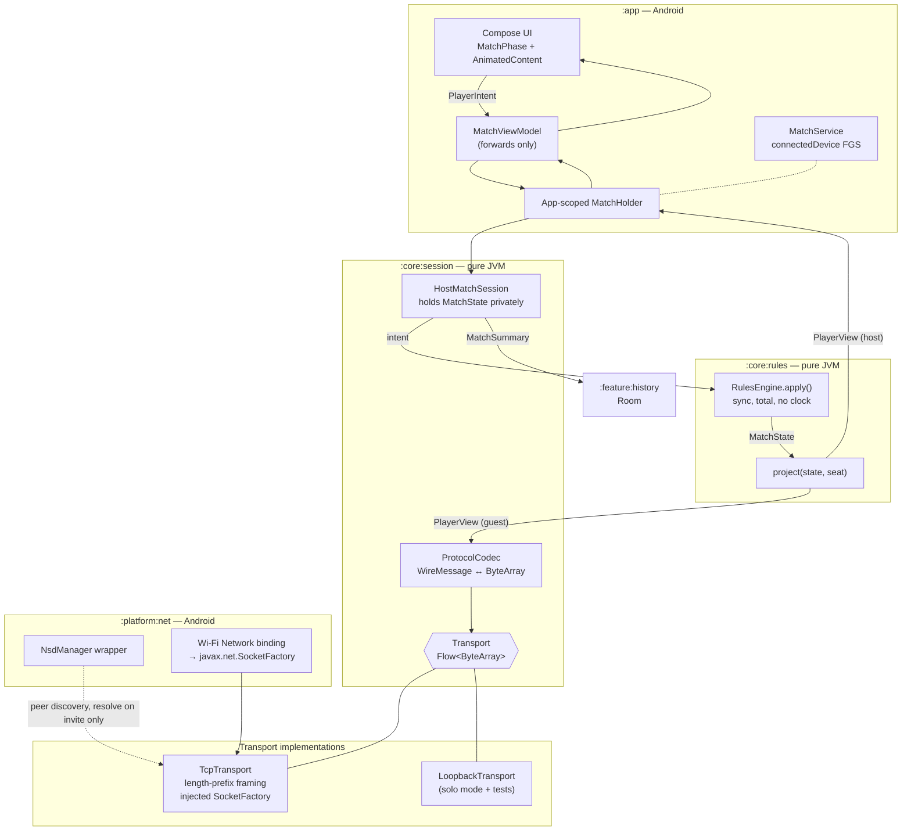

# Top Trumps Core Game — Technical Design

**Feature:** [`PRD.md`](PRD.md)
**Date:** 2026-07-30
**Status:** Draft

## Architecture at a Glance

- **Six Gradle modules.** `:core:rules`, `:core:decks`, `:core:session` and `:core:ai` use the `kotlin("jvm")` plugin, so `import android.*` is a **compile error** rather than a code-review comment. Only `:platform:net`, `:feature:history` and `:app` are Android. ([ADR](../../adr/top-trumps-core-game-module-structure.md))
- **The reveal rule is enforced by the type system, not by discipline.** `MatchState` has no serializer and never leaves the host. Players see a `PlayerView` produced solely by `project(state, seat)`, in which the opponent's card is a sealed type with **nowhere to put** unplayed stats. ([ADR](../../adr/top-trumps-core-game-structural-redaction.md))
- **`Transport` carries raw bytes, not typed messages**, so the PRD's single test seam exercises the real serialisation codec and framing rather than bypassing them. ([ADR](../../adr/top-trumps-core-game-byte-transport.md))
- **Solo mode is two real sessions over a `LoopbackTransport`** — production code, not a test double. The AI drives the guest through the same public interface a human's UI uses, so it structurally cannot cheat, and every solo game is a live integration test of the wire protocol.
- **The PRD's interruption model is insufficient and is being replaced.** `FLAG_KEEP_SCREEN_ON` does not address backgrounding, which is the dominant interruption. A `connectedDevice` foreground service is required, and costs zero runtime permission prompts. ([ADR](../../adr/top-trumps-core-game-foreground-service.md))
- **Three PRD assumptions were found to be factually wrong** (multicast lock, keep-screen-on sufficiency, the no-draw invariant) and one product-visible claim is unverified (NSD needs no runtime permissions). A day-zero spike gates the whole design.

---

## Design Decisions

### 1. Module structure

[ADR: module structure](../../adr/top-trumps-core-game-module-structure.md)

| Module | Plugin | Contains | Android? |
|---|---|---|---|
| `:core:rules` | `kotlin("jvm")` | Domain model, `RulesEngine`, `MatchState`, `PlayerView`, `project()` | Never |
| `:core:decks` | `kotlin("jvm")` | Manifest DTO, parser, validator, `DeckSource`, hashing | Never |
| `:core:session` | `kotlin("jvm")` | `MatchSession`, `Transport`, wire types, codec, `TcpTransport`, lobby pure logic | Never |
| `:core:ai` | `kotlin("jvm")` | `OpponentStrategy`, `AiOpponentDriver` | Never |
| `:platform:net` | `com.android.library` | `NsdManager` wrapper, Wi-Fi `Network` binding, socket factories | Unavoidably |
| `:feature:history` | `com.android.library` | Room entities, DAOs, stats queries | Unavoidably |
| `:app` | `com.android.application` | Compose UI, ViewModels, `MatchService`, audio, `AppGraph` | Unavoidably |

Deck **content** lives at repo root in `decks/`, outside every module (see §7).

No dependency-injection framework. A hand-written `AppGraph` in `:app` is smaller than Hilt at this size and removes the temptation to inject `Context` where it doesn't belong. `:core:*` may depend only on `kotlinx-coroutines-core`, `kotlinx-serialization-json`, `kotlinx-datetime` and `androidx.annotation` — enforced by a CI check.

**Toolchain:** `minSdk 26`, `targetSdk 35`, `compileSdk 37`, JVM target 17, Kotlin 2.x with the `org.jetbrains.kotlin.plugin.compose` plugin, Gradle Kotlin DSL, version catalog, four convention plugins in `build-logic`. R8 **off** for v1 — the APK is 90% images, and minification buys an entire class of release-only serialisation and Room failures for ~300KB.

`compileSdk` tracks the newest available platform (37 at time of writing) since it only sets the API surface compiled against and must simply be `>= targetSdk`. `targetSdk` is the value actually held back, deliberately, one below the newest: 35 enforces edge-to-edge (real Compose work, budgeted) while 36 is where Local Network Protection would first bite (see §11).

### 2. Rules engine and the projection boundary

[ADR: structural redaction](../../adr/top-trumps-core-game-structural-redaction.md)

`RulesEngine` is a **synchronous, total reducer**. No `suspend`, no clock, no IO:

```kotlin
object RulesEngine {
    fun deal(deck: Deck, config: MatchConfig, random: Random): MatchState
    fun apply(state: MatchState, seat: Seat, intent: PlayerIntent): StepResult
}
```

It speaks `Seat.HOST` / `Seat.GUEST`, never display names, and never names a metric — `MetricKey` is a value class over `String` and comparison is `compare(a, b, direction)`. There is no `when (metric)` anywhere in `:core:rules`; that absence is the "second deck, zero code change" guarantee and is grep-checkable.

**Redaction is structural.** The opponent's card is a sealed type whose contested variant has no field capable of holding an unplayed stat:

```kotlin
data class RevealedMetric(val metric: MetricKey, val value: StatValue)

sealed interface OpponentCardView {
    data object FaceDown : OpponentCardView
    data class Contested internal constructor(val revealed: List<RevealedMetric>) : OpponentCardView
    data class Revealed  internal constructor(val card: CardFace) : OpponentCardView
}
```

A tiebreak chain naturally accumulates entries in `revealed` — after two ties, two stats are legitimately visible, expressed by construction rather than by a filter. All `PlayerView` types use `internal constructor` **plus** `@ConsistentCopyVisibility` (without the annotation a data class with an internal constructor still leaks a public `copy()`, which is exactly the hole a ViewModel would widen through). `explicitApi()` is on for all `:core:*`.

**The host consumes its own game through `project()` too.** It never hands `MatchState` to its own UI. One leak test therefore covers both seats, and the host has no bespoke rendering path that can drift.

`PlayerView` carries a monotonic `revision: Long`. `StateFlow` conflates on `equals()`, so a transition producing a structurally identical view would silently fail to emit — breaking both the UI and any test asserting "the state changed". This is cheap insurance against a maddening class of bug.

### 3. Round state machine and tiebreak termination

Only two round states are genuinely authoritative. Because `apply()` is synchronous and total, there is no durable "comparing" or "revealed" moment on the host — a submitted intent is applied and resolved in one call, and the resulting view already carries everything needed to show the winner and flip the card. `Committed`, `Comparing`, `Revealed` and `Advance` are **client-side presentation states** that never touch the wire.

```kotlin
sealed interface RoundState {
    data class AwaitingChoice(
        val chooser: Seat,
        val remainingMetrics: List<MetricKey>,   // strictly decreasing
        val revealHistory: List<RevealedMetric>
    ) : RoundState

    data class Resolved(
        val winner: Seat?,                        // null only under EACH_KEEPS_OWN
        val decidingMetric: MetricKey,
        val revealHistory: List<RevealedMetric>
    ) : RoundState
}
```

**Termination proof:** every tie removes the tied metric from `remainingMetrics`, which is a natural number bounded below by zero and strictly decreasing by one per tie. A round therefore resolves in at most five selections. The recursion lives in the observable sequence of states across repeated external intents — `apply()` never loops internally, which is what keeps it a trivial synchronous function.

**Connection state is orthogonal** to match state and never reaches the engine:

```kotlin
sealed interface ConnectionState {
    data object Disconnected; data class Connecting(val attempt: Int)
    data object Connected
    data class PeerAbsentGrace(val remaining: Duration)
    data object Abandoned; data class PeerLeftDeliberately(val reason: LeaveReason)
}
```

A `MatchState` can sit untouched through several `Connected → PeerAbsentGrace → Connected` cycles.

### 4. The all-metrics-tie fallback — resolving the PRD's open question

[ADR: all-metrics-tie fallback](../../adr/top-trumps-core-game-all-metrics-tie.md)

**The PRD contains a contradiction.** It asserts "no drawn match is possible — both scores are even and sum to 30", *and* specifies the fallback as "each player keeps their own card". Those cannot both hold: a round settled that way awards one card to each pile, making the scores odd and **15–15 reachable**. As written, the engine would have a specified state that violates a documented invariant, and the test suite would encode the contradiction.

**Decision: the chooser wins**, and the behaviour is `MatchConfig.allMetricsTieFallback: TieFallback = CHOOSER_WINS`. This preserves the no-draw invariant, keeps `piles.sum() == 30` honest as a test assertion, and removes draw handling from the UI entirely. Encoding it as config rather than a hardcoded branch means all three candidates are exhaustively testable and the answer is a one-line change.

The configured value **rides the wire** in `MatchConfig`, because the guest never runs the engine and would otherwise be unable to render the correct explanation if it ever fired.

### 5. Wire protocol

[ADR: byte transport, framing and serialisation](../../adr/top-trumps-core-game-byte-transport.md)

Two **separate** sealed hierarchies, `GuestToHost` and `HostToGuest`, so it is a compile error for either side to construct the other's messages — the thin-client property is enforced by types, not convention.

The PRD's "metric chosen / round resolved / tiebreak required / full reveal / advance round" collapses to a **single `View` message**, because `Resolved`'s projected view already contains all five UX moments. Pushing current state rather than transition events also makes reconnection trivial (§6) — there is no replay logic to write.

| Message | Direction | Notes |
|---|---|---|
| `Invite` / `InviteAccept` / `InviteDecline(reason)` / `InviteCancel` | lobby, bidirectional | `reason ∈ {USER_DECLINED, BUSY}` |
| `Hello(protocolVersion, displayName, instanceId)` | guest → host | |
| `HelloAck(sessionToken)` / `VersionMismatch(hostVersion)` | host → guest | issues resume token, or refuses |
| `DeckChosen(deckId, deckHash, config)` | host → guest | guest validates hash locally, may reply `DeckMismatch` |
| `MatchStart(yourHand, roundCount)` | host → guest | discrete, so the deal animation has an unambiguous trigger |
| `Intent(seq, roundNumber, payload)` | **guest → host** | the guest's *only* gameplay message |
| `View(seq, view, cause, resync)` | host → guest | subsumes all in-round transitions |
| `PeerDisconnected(graceRemainingMs)` / `PeerReconnected` | host → guest | discrete UI triggers |
| `Resume(sessionToken, pendingIntent?)` / `ResumeAck` / `ResumeRejected` | reconnection | §6 |
| `Leave(deliberate)` / `Abandoned(reason)` | | `reason ∈ {GRACE_EXPIRED, PEER_QUIT}` |
| `Heartbeat` / `HeartbeatAck` | | §8 |
| `RematchOffer` / `RematchResponse` | | new session token per rematch |

**Framing: 4-byte big-endian length prefix**, read via `DataInputStream.readFully`. Not newline-delimited — display names can contain anything, and delimiter-safety would be a property of the serialisation format rather than of the framing. Max frame 16KB expected / 64KB hard ceiling; a header claiming more is treated as a corrupt stream and the connection dropped.

**Serialisation: kotlinx.serialization JSON.** Payloads are tiny (no images cross the wire — cards are referenced by string and resolved locally). Binary formats earn their keep by supporting independently-versioned peers, which is irrelevant when both devices always run the same sideloaded APK. JSON's readability in logcat during two-phone debugging is worth more.

**Versioning: a single `Int`, strict equality, hard refuse.** There is no server to be out of step with; story 17's real scenario is "one phone auto-updated before the other". The version also goes in the mDNS instance record as an unauthenticated hint so incompatible peers can be badged in the lobby before anyone taps invite — `Hello`/`HelloAck` remains the sole authoritative gate.

**Two gates, not one.** The PRD's single word "handshake" conflates them: protocol version must be checked before deck selection is even possible; the deck hash can only be checked after Player One picks, still before dealing.

**Socket role ≠ match role.** Whoever dials TCP is not necessarily the match host — the inviter is host regardless of which device called `connect()`. This must be named explicitly in the transport code so nobody wires it backwards.

### 6. Reconnection and idempotency

[ADR: full-state resync](../../adr/top-trumps-core-game-reconnect-resync.md)

The PRD says only "resumes using a session token" and does not address the hard part: an intent sent but never acknowledged.

**Client invariant: at most one intent in flight.** The choice UI is disabled until the resolving `View` arrives. This makes "pending intent" a single optional value rather than a queue with gap detection, and it is what makes the whole scheme tractable.

Guest envelopes carry a monotonic `seq`; the host tracks `lastAcceptedGuestSeq`. On `Resume(sessionToken, pendingIntent?)`:

1. Validate the token → else `ResumeRejected(UNKNOWN_SESSION)`.
2. If a pending intent is present, compare `seq` to `lastAcceptedGuestSeq`: `<=` means it was already applied before the drop — **do not re-apply**; `== last + 1` means it never arrived — apply it normally. Anything else is a protocol violation.
3. Reply `ResumeAck` with a **full `project()` of current state**, not an event replay.

Because `apply()` is synchronous and total, **no transition can be half-applied** — either the whole thing happened or none of it did, and the seq comparison distinguishes those two cases unambiguously. A mid-flight tiebreak needs no special case: `remainingMetrics` and `revealHistory` are ordinary fields of `MatchState`, captured and resent by the same path.

A `resync: Boolean` flag tells the client to hard-cut rather than replay stale animations. Session tokens are regenerated per rematch, so a late `Resume` from a finished match cannot land in the new one.

**Host-drop and guest-drop are not symmetric**, and the PRD's language implies they are. A guest drop is genuinely recoverable — the host's state is untouched. A host drop is only recoverable if it was a transient blip that didn't kill the host's in-memory state; if the host process is gone there is nothing to resume into. The countdown copy must not imply otherwise.

### 7. Deck storage and loading

[ADR: deck storage](../../adr/top-trumps-core-game-deck-storage.md)

**Deck content lives at repo root**, in no module:

```
/decks/motorcycles/manifest.json
/decks/motorcycles/images/*.webp
```

`:app` adds it as an asset source directory (`assets.srcDir(rootProject.file("decks"))`) rather than a `Copy` task — no task ordering, no stale copies, correct incremental behaviour. Access is behind a pure interface:

```kotlin
interface DeckSource {                      // :core:decks, no Android, no classpath assumptions
    fun listDecks(): List<String>
    fun open(deckId: String, path: String): InputStream
}
```

Android implementation wraps `AssetManager`; JVM tests wrap `java.io.File` and read the **real** deck content, so validation tests need no fixture double.

**A JVM module's `src/main/resources/` cannot satisfy this requirement.** Point-reads work on Android, but *directory enumeration over the classpath is impossible on Android* — `getResource("decks/")` yields nothing walkable. That would force a hardcoded deck list, which is exactly what the PRD forbids. `assets/` is the only location that supports enumeration. Placing the content in both would also silently ship 3.6MB twice.

**Images: WebP lossy q80 at ~1080px long edge**, ≈120KB each, ≈3.6MB total. Coil 3 with `AsyncImage` on `file:///android_asset/…`, **disk cache disabled** (the source is already local), and **explicit sizes per usage** — a win-pile grid loading full-resolution bitmaps is 3.5MB each in memory and will OOM at 30.

**Deck hash covers the manifest bytes only**, or is precomputed at build time. Hashing 3.6MB of images during the handshake is 100–300ms of the user waiting, and the manifest already names every image; this guards against version skew between two copies of our own app, not tampering.

**Age is modelled as `LOW_WINS` on the stored year** — identical in outcome to "higher age wins", but it removes any concept of a derived metric or a clock from the engine, making the PRD's "independent of the current date" test trivially true. The "N years" rendering is a UI display transform declared in the manifest (`display: YEARS_SINCE_VALUE`) and applied with an injected `Clock`.

### 8. Networking on the device

[ADR: Wi-Fi network binding](../../adr/top-trumps-core-game-wifi-network-binding.md) · [ADR: discovery via instance name](../../adr/top-trumps-core-game-discovery-instance-name.md)

**The PRD's biggest discovery mistake is that its symmetric lobby maximises exactly the `resolveService` concurrency it flags as risky.** `onServiceFound` yields only the service name and type — no TXT records — so rendering names would require resolving every peer. **Fix: put the display name in the mDNS instance name** (`Russ·a1b2c3d4`, ≤63 UTF-8 bytes). The lobby then renders from `onServiceFound` alone with **zero resolves**, and exactly one resolve happens per game, user-paced, when someone taps invite. The UUID suffix simultaneously provides self-filtering that survives auto-rename and the mutual-invite tiebreak key.

Other NSD rules, each a known failure mode:

- Read `serviceName` from `onServiceRegistered`, never the value passed in — auto-rename on collision is real and its format is not contractual.
- **Normalise trailing dots** on `serviceType` before comparing; some versions return `_toptrumps._tcp.` and the mismatch silently yields a permanently empty lobby.
- Fresh listener object per discovery/registration session, always. Reuse throws `listener already in use`, and `stopServiceDiscovery` is async.
- `onServiceLost` is unreliable — goodbye packets are routinely dropped. **Story 8 will feel broken without a last-seen TTL** (prune at ~30s, refresh on re-announcement, treat `onServiceLost` as one hint).
- Restart discovery on `ConnectivityManager` network changes; Wi-Fi roaming kills it with no callback.
- **No `MulticastLock` is needed.** That requirement belongs to in-process stacks like JmDNS; `NsdManager` runs mDNS in a system daemon. The PRD's permission list is wrong here.
- Bind `ServerSocket(0)` and read `localPort` *before* registering — `setPort(0)` is rejected.

**Multi-network routing is the failure most likely to be hit and is absent from the PRD.** A phone with both Wi-Fi and mobile data, where the Wi-Fi has no internet, routes `Socket("192.168.1.42", …)` over cellular, and it fails. Fix: obtain the Wi-Fi `Network` via `registerNetworkCallback` and create sockets through **injected `javax.net.SocketFactory` / `ServerSocketFactory`** supplied by `:platform:net`. These are pure-JVM interfaces, so `:core:session` keeps its socket logic and its Android-freedom simultaneously. This also mitigates the VPN case the PRD does list.

**Socket hygiene:** `accept()` and `read()` do not respond to coroutine cancellation — close the socket from outside via `job.invokeOnCompletion`, set `soTimeout` to the heartbeat interval, use a **single writer coroutine** consuming a `Channel` (two writers interleave frames), and set `TCP_NODELAY`. Never construct `.local` hostnames; take the `InetAddress` straight off `NsdServiceInfo`.

**Half-open detection requires an application heartbeat.** TCP keepalive defaults to 2 hours and Android exposes no way to tune it; retransmission timeout is 13–30 minutes; and `Socket.isConnected()` returns `true` forever on a half-open socket. Design: **2s ping (piggybacked on any traffic), 3 misses ≈ 6s to declare the peer unreachable, then the 60s grace countdown begins.**

Deliberate quit sends `Leave`, flushes, then `shutdownOutput()` before closing, so the peer's read returns `-1` cleanly — that is what makes story 62 reliable even if the frame races.

### 9. Lifecycle — foreground service

[ADR: foreground service](../../adr/top-trumps-core-game-foreground-service.md)

**The PRD is wrong that `FLAG_KEEP_SCREEN_ON` addresses the main risk.** It prevents display timeout — the *least* likely interruption in a game the user is actively looking at. The dominant interruption is backgrounding, which this app actively invites ("let me look up that Vincent"). A backgrounded process is frozen (often within seconds on OEM ROMs), its coroutines stop, its heartbeat stops, and recent Android versions actively reset sockets held by frozen UIDs.

**A `connectedDevice` foreground service runs for the duration of a match.** It costs **zero runtime prompts**: `FOREGROUND_SERVICE`, `FOREGROUND_SERVICE_CONNECTED_DEVICE` and `CHANGE_NETWORK_STATE` are all normal permissions, and the service runs whether or not `POST_NOTIFICATIONS` is granted — denial only hides the notification. Started from the foreground at match start, `startForeground()` within 5s, stopped the instant the match ends. Not used in lobby or solo mode.

Keep-screen-on is retained but scoped to the match screen via `DisposableEffect` on `LocalView`, not the whole Activity.

**Reconnect stays the primary designed path regardless** — OEM task-killers and swipe-from-recents defeat any FGS. To make it fast, the host's port and session token ride the invite payload so the guest can **re-dial directly with no re-resolve** in the common case, falling back to NSD only if that fails: ~200ms instead of ~3s, and the flaky resolve leaves the recovery path.

**On "activity-retained scope rather than a ViewModel":** that was a false dichotomy in the architecture review. An Activity-scoped `ViewModel` *is* activity-retained scope, and rejecting it means hand-rolling `onRetainNonConfigurationInstance`. Resolution: `MatchSession` stays a plain class in `:core:session`, **held by an application-scoped holder** whose lifetime mirrors the foreground service, and exposed to the UI by a thin ViewModel that only forwards the `StateFlow` and intents. Portrait-only does not prevent configuration changes (dark mode, font size, locale, multi-window) — and `android:configChanges` is not the fix.

### 10. UI

Navigation-Compose (type-safe routes) for `Lobby / ManualConnect / Settings / History / Stats / Match`, where the *user* drives navigation and a back stack is meaningful. **Inside `Match`, a sealed `MatchPhase` + `AnimatedContent`, not nav destinations** — match phase is dictated by host state, and calling `navigate()` from a `StateFlow` collector produces double-navigation, back-stack corruption when a phase repeats (tiebreak → tiebreak), and a back button that pops into a phase the host has left. The win-pile browser is a state within the match, satisfying story 50's "return without losing my place".

Roughly 13 screens plus 4 dialogs (incoming invite, version/deck mismatch, opponent-dropped countdown, quit confirmation).

State reaches the UI via `collectAsStateWithLifecycle()`. **One-shot events must not ride that collection** — it stops at `STOPPED`, so a sound or a toast modelled as derived state is silently dropped while backgrounded. Route those through a `Channel` collected under `repeatOnLifecycle`, or derive them in the session layer which collects unconditionally.

**Compose stability across the pure-JVM boundary is a structural trap.** `:core:*` are compiled without the Compose compiler, so `PlayerView` and its collections are inferred **unstable**, and the entire match screen would recompose on every emission — during animations. Fix with strong skipping plus a `stabilityConfigurationFile` listing the core packages. Do **not** add `androidx.compose.runtime` to `:core` to use `@Immutable`; that defeats the module discipline. Verify with recomposition counts before the animations land.

Card flip: `Modifier.graphicsLayer { rotationY; cameraDistance }` — `cameraDistance` must be raised to ~12–16× density or the perspective is grotesque, and the back face must be counter-rotated 180° or it renders mirrored. Driven by `Animatable` so reconnect can `snapTo` without animating. Slide-to-pile: an **overlay `Box` with an animated offset**, not `SharedTransitionLayout` (overkill, and the source composable is leaving the tree). Both must use the **lambda modifier overloads** (`graphicsLayer { }`, `offset { }`) — the value-taking versions recompose every frame.

Audio via `SoundPool` (`USAGE_GAME`), preloaded at app start with `setOnLoadCompleteListener`; `load()` is async and the first sound is otherwise silent.

Edge-to-edge is enforced at `targetSdk 35`: the always-visible score bar will render under the status bar without inset handling. Budget half a day.

### 11. Persistence

[ADR: Room for match history](../../adr/top-trumps-core-game-match-history-room.md)

**Room**, confined to `:feature:history`. The deciding factor is "most-won cards": `cards won` is one-to-many, so a `match_card_win` child table makes it one `GROUP BY`, whereas any document store means loading every match and folding by hand — more code than Room's entire setup, and slower with every match played. `exportSchema = true`, schemas committed.

History is fed by a **collector**, not a dependency: `:core:rules` emits a `MatchSummary` value at match end, the session decorates it with opponent name and an injected clock, and `:app` observes and records. `:feature:history` can be deleted and `:core:*` still compiles.

Display name and mute go in **Preferences DataStore**. Warning: DataStore is async and story 1 depends on its first read — render a `Loading` state rather than `runBlocking` on the main thread, and construct exactly one instance per file.

Device-name prefill (story 2) uses `Settings.Global.DEVICE_NAME` with a `Build.MODEL` fallback. **Not** `BluetoothAdapter.getName()`, which needs a runtime permission and would breach the no-prompts promise for a text-field default.

### 12. Lobby invitation resolution

The PRD's UUID-comparison rule for simultaneous mutual invitations is sound — it is standard lowest-id election and correctly needs no coordinator — but it is incomplete in three ways, all of which must be explicit and tested:

1. **Socket disposal is unspecified.** Both devices dialling produces *two* live TCP connections. The winning socket is retained; the loser sends `InviteCancel` on the losing socket before closing, so the peer gets a clean UI transition rather than a bare close indistinguishable from a fault.
2. **Detection must be receive-side.** True simultaneity is rare; the real case is an inbound invite arriving while an outbound one is pending. The check is state-based on every inbound invite, and there must be a test named for it: *given an outbound pending invite to X, an inbound invite from X arrives → resolve by UUID and transition straight to Accepted, skipping the prompt.*
3. **`DeclineReason.BUSY`** so a third device gets an honest answer rather than a silent timeout.

`InvitationResolver` and `LobbyReducer` are pure functions in `:core:session`, tested directly with no double — the mandate is one *double*, not one *test*.

---

## Component/Data Flow



**A round, end to end.** The chooser taps a stat → `PlayerIntent.ChooseMetric` reaches `HostMatchSession` (locally, or as an `Intent` frame from the guest) → `RulesEngine.apply` produces a new `MatchState` synchronously → `project()` is called **twice**, once per seat → the host's view goes to its own UI, the guest's is encoded to JSON, length-prefixed, and written by the single writer coroutine. If the metric tied, both views show `AwaitingChoice` with the tied metric absent from `remainingMetrics` and present in `revealHistory`; the same chooser picks again. If it resolved, both views carry `OpponentCardView.Revealed` and the piles have moved.

At no point does the guest's device receive an unplayed stat, because the encoder for `MatchState` does not exist.

---

## Testing Approach

**Primary seam (per the PRD):** a pair of `MatchSession` instances over an in-memory `Transport`. Because `Transport` carries bytes, this seam exercises the real codec and message contracts, not just the rules. Because solo mode ships `LoopbackTransport` as production code, the double is exercised on every solo game and cannot rot into a fiction.

Covered at the seam: full match to completion (winner correct, `piles.sum() == 30`, turn alternation held), win direction both ways, age comparison independent of the current date, tiebreak recursion and metric exclusion, the all-metrics-tie fallback, handshake refusal on version/deck/hash mismatch, deliberate quit distinguishable from a drop, grace-window resume and expiry, and **information leakage** — asserting structurally that the mid-round view's opponent card is `Contested` with exactly the played metrics, and additionally serialising the view and asserting no unplayed stat value appears anywhere in the JSON. That second assertion is crude but it is what catches an accidental field addition a year from now.

**Three additions to the PRD's plan, each of which removes something from the "manual only" bucket:**

1. **Loopback TCP tests in `:core:session`** — a real `ServerSocket` on `127.0.0.1:0`, plain JVM, no emulator. Framing bugs (partial reads, two messages in one read, a message split across segments) are invisible on a fast LAN and surface once in ten games in the field. One test file, not a new seam.
2. **Pure lobby-logic tests** — `InvitationResolver` and `LobbyReducer` tested directly, no double, including the named mutual-invite case in §12.
3. **Deck validation against the real `decks/` content** via the `java.io.File` `DeckSource`, so there is no fixture to drift from production data.

**Two hard constraints that must be decided in slice 1, not retrofitted in slice 5:**

- **No hardcoded `Dispatchers.*` anywhere in `:core:*`.** `runTest`'s virtual time only applies if production `delay` runs on the injected test dispatcher; a stray `withContext(Dispatchers.IO)` makes the 60s grace test really take 60 seconds and then fail. This is a constructor-signature decision.
- **The grace countdown must be `delay`-driven, not wall-clock.** `System.currentTimeMillis()` does not move under virtual time, so a "record start, compare to now" implementation is untestable. A `flow { repeat(60) { emit(60 - it); delay(1.seconds) } }` is both virtual-time friendly and exactly what story 58's countdown UI needs.

**Design for synchronous assertion.** After each `suspend fun` returns, state should be settled so tests can read `.value` directly. `StateFlow` is conflated and drops intermediate values, so tests asserting a *sequence* of transitions are inherently flaky — and values `StateFlow` never emitted cannot be recovered by any library, Turbine included. Turbine is the one extra test dependency, for the cases that genuinely need transition sequences.

Confine all state mutation to a single dispatcher (`Dispatchers.Default.limitedParallelism(1)`), and always use `MutableStateFlow.update {}` — host-authoritative state mutated from both the socket-read coroutine and the UI path is otherwise a data race.

**Out of scope for automated coverage:** `NsdManager` behaviour, Compose UI, animations, audio, foreground-service lifecycle, and OEM background-kill behaviour. All require two physical devices. **An emulator and a phone will never discover each other over NSD** — the emulator is behind NAT on `10.0.2.x` and mDNS multicast does not cross it, and two emulators don't see each other either. Two physical devices are mandatory hardware for slice 4; plan them before planning the slice.

---

## Open Questions

1. ~~**The NSD permissions spike is a gate on the whole product premise, and must run before slice 1.**~~ **Resolved by the Slice 0 spike (2026-07-31).** The PRD's "no runtime permissions at all" claim is **confirmed**. Tested with a throwaway app declaring only `INTERNET` and `ACCESS_NETWORK_STATE` on two physical devices — a Samsung Galaxy S21 Ultra (Android 13, API 33) and a Samsung Galaxy Tab S7 FE (Android 14, API 34) — both on the same Wi-Fi. Registration and discovery worked with **no runtime permission dialog on either device**; `dumpsys package` confirmed no permission beyond the declared two was ever attached. `NEARBY_WIFI_DEVICES` is **not** demanded on API 33 or 34. No `MulticastLock` was held at any point, and discovery worked regardless. Two additional failure modes flagged in §8 were also confirmed live: `onServiceFound` returns `serviceType` with a **trailing dot** (`_toptrumps._tcp.`) on both devices, and a name collision triggers Android's **auto-rename**, observed in the format **`"<name> (2)"`** (confirmed by registering `"Spike"` on both devices — the second registrant got back `actualServiceName = "Spike (2)"`) — evidence this format must never be parsed. Concurrent `resolveService` calls do fail with `FAILURE_ALREADY_ACTIVE` (`errorCode=3`) on the S21 Ultra (API 33) — of N calls fired back-to-back, only the first succeeds and the rest fail immediately — but this is **not** a permanent wedge: a later, non-concurrent `resolveService` call for the same service resolved successfully. Interestingly, the Tab S7 FE (API 34) accepted all concurrent calls with no failures at all — a real cross-version difference worth keeping in mind, though it doesn't change the design (never rely on concurrent resolves succeeding). Source and full logs: `spike/slice-0-nsd` branch, throwaway app deleted after use per the WBS.

2. **Local Network Protection may put this app behind a runtime permission on future Android.** Android 16 introduced work gating local-subnet access — mDNS *and* direct RFC1918 socket connections — behind a new permission, believed to have shipped opt-in with enforcement intended later. Confirm current status before finalising the no-permissions claim. This is why `targetSdk` is held at 35. **Partially attempted in the Slice 0 spike (2026-07-31) and still open:** neither available test device runs Android 16/API 36 (only API 33 and 34 were available), so this could not be exercised. No evidence of LNP-related blocking was seen on API 33/34, consistent with the TDD's expectation, but the API 36 case remains genuinely unconfirmed pending access to newer hardware.

3. **The all-metrics-tie fallback is now decided as `CHOOSER_WINS` (§4) rather than the PRD's "each keeps their own card"**, because the PRD's version contradicts its own no-draw invariant. Worth your explicit sign-off, since it reverses a stated (if flagged) PRD decision. It remains config, so reversing costs one line — but reinstating `EACH_KEEPS_OWN` means accepting that 15–15 draws exist and building draw handling into the result screen.

4. **Rematch role continuity is unspecified in the PRD.** Does the host stay host across a rematch (simplest — reuse the transport, fresh session token), or does Player One rotate for fairness? A product question, not an implementation detail.

5. **Should the choice UI be gated on local reveal-dismissal?** Since the host advances the round immediately with no wire ack, a fast player can commit their next choice before the opponent has dismissed the previous reveal. Not a correctness bug given the redaction model, but it needs a deliberate answer. Recommendation: gate it — it's cheap and client-only.

6. **Slice 4 is bigger than the PRD's framing suggests** and should be split for `/to-wbs` into "discovery + lobby" and "handshake + match transport". The platform work identified here — foreground service, Wi-Fi network binding, edge-to-edge insets, Compose stability configuration — is real effort that appears nowhere in the PRD's 82 stories.
